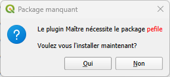
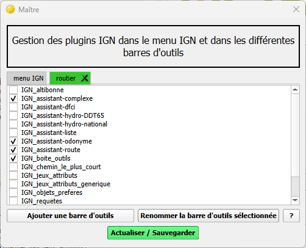
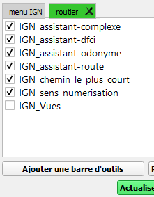
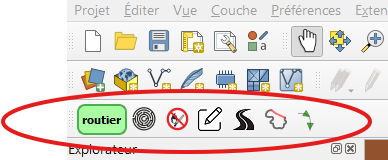
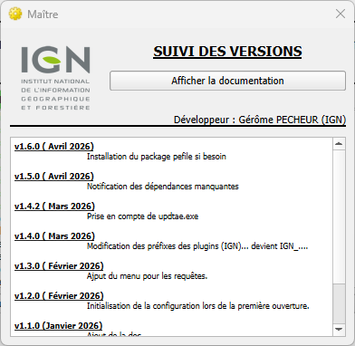

<table>
<colgroup>
<col style="width: 21%" />
<col style="width: 78%" />
</colgroup>
<tbody>
<tr>
<td rowspan="2"></td>
<td style="text-align: center;"><strong>Plugin Maitre
v1.6.0</strong></td>
</tr>
<tr>
<td style="text-align: center;"></td>
</tr>
</tbody>
</table>

**Sommaire**

1. [Prérequis](#prérequis)

2. [Résumé](#résumé)

3. [Installation](#installation)

4. [Présentation](#présentation)

4.1 [Onglet menu IGN](#onglet-menu-ign)

4.2 [Barres d’outils](#barres-doutils)

4.3 [Suivi des versions et documentation](#suivi-des-versions-et-documentation)

# 

# 1. Prérequis

Version de QGIS : version 3 supérieure à 3.28

Cette version est compatible QGIS 4

# Résumé

Le plugin Maitre crée un menu IGN dans la barre des menus.

Ce menu permet de lancer l’interface et d’ouvrir spécifications de la
BDTOPO©.

Le plugin maitre permet d’organiser l’affichage des différents plugins
IGN dans le menu et la barre d’outils.

# Installation

Le plugin Maitre s’installe avec l’exécutable d’installation
(\*\_PluginIGN_installer »

Le plugin a besoin du package « pefile » pour tester la mise à jour de
l’installateur.

Si ce package n’est pas installé le plugin maitre propose de
l’installer :

Si on choisit de ne pas l’installer ce n’est pas bloquant mais si une
mise à jour de l’installateur est disponible, elle ne pourra pas
s’installer.

Si on choisit d’installer le package « pefile » il est primordial à la
fin de l’installation de redémarrer QGIS pour que ce package soit prit
en compte.

# Présentation

L’interface permet d’organiser l’affichage des plugins en les classant
dans des onglets.

## Onglet menu IGN

Par défaut l’onglet menu IGN affiche dans le menu IGN les plugins
cochés.

Les plugins proposés sont détectés automatiquement.

## Barres d’outils

- Ajouter une barre d’outils 

> Choisir un nom et cliquer sur Ajouter crée un nouvel onglet. Les
> plugins cochés dans cet onglet s’ajouteront dans un groupe dans la
> barre d’outils QGIS.

<figure>

<figcaption aria-hidden="true">

</figcaption>
</figure>

- Renommer la barre d’outils 

> Pour changer le nom du groupe (routier pour l’exemple ci-dessus).

##  Suivi des versions et documentation

>  style="width:0.31254in;height:0.2292in" /> Affiche l’historique des
> versions la documentation de l’outil.
>
>  style="width:3.14818in;height:3.06787in" />
