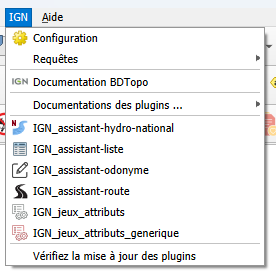

<table>
<colgroup>
<col style="width: 21%" />
<col style="width: 78%" />
</colgroup>
<tbody>
<tr>
<td rowspan="2"></td>
<td style="text-align: center;font-size: 24px;"><strong>Plugin Maitre
v1.7.2</strong></td>
</tr>
<tr>
<td style="font-size: 16px;text-align: center;">Développeur  : Gérôme PECHEUR (IGN)</td>
</tr>
</tbody>
</table>
  

## Sommaire

- [1. Prérequis](#prerequis)
- [2. Résumé](#resume)
- [3. Installation](#installation)
- [4. Présentation](#presentation)
- [5 Suivi des versions et documentation](#suivi-des-versions-et-documentation)

  <h2 id="prerequis" style="color: white;margin:0;" >1. Prérequis</h2>

Version de QGIS : version 3 supérieure à 3.28
Cette version est compatible QGIS 4

  <h2 id="resume" style="color: white;margin:0;" >2. Résumé</h2>

Le plugin Maitre crée un menu IGN dans la barre des menus.

Ce menu permet de configurer l'interface (intégration des différents plugins IGN dans les menus et / ou dans des barres d'outils, d'ouvrir les documentations des plugins IGN, de vérifier les mises à jour disponibles des plugins pris en compte

  <h2 id="installation" style="color: white;margin:0;" >3. Installation</h2>

Le plugin Maitre s’installe avec l’exécutable d’installation
(\*\_PluginIGN_installer »

Le plugin a besoin du package « pefile » pour tester la mise à jour de
l’installateur.

Si ce package n’est pas installé le plugin maitre propose de
l’installer :

Si on choisit de ne pas l’installer ce n’est pas bloquant mais si une
mise à jour de l’installateur est disponible, elle ne pourra pas
s’installer.

Si on choisit d’installer le package « pefile » il est primordial à la
fin de l’installation de redémarrer QGIS pour que ce package soit prit
en compte.

  <h2 id="présentation" style="color: white;margin:0;" >4. Présentation</h2>

==Lors de l’ouverture d’un projet QGIS, le plugin maître détecte automatiquement si des mises à jour sont disponibles pour les plugins IGN.==

Ce plugin ajoute un menu IGN dans la barre des menus de QGIS.   

 
- Configuration : Permet de configurer l’interface (intégration des différents plugins IGN dans les menus et / ou dans des barres d’outils).  

Ici il est possible de choisir les plugins à intégrer dans le menu IGN et / ou dans des barres d’outils.
Les plugins préfixés "IGN_" sont détectés automatiquement.  
Le premier onglet concerne le menu IGN. Il n’est pas possible de le renommer, car il s’agit du menu par défaut.  
Les autres onglets sont des barres d'outils, Il est possible de les renommer et d’en ajouter autant que nécessaire.

- Requête : non fonctionnel pour l’instant
- Documentation BDTopo : adffiche la documentation de la BDTopo (https://bdtopoexplorer.ign.fr/)
- Documentation des plugins : affiche la documentation de tous les plugins IGN disponibles dans l'installation.
- La liste des plugins IGN ajoutés dans le menu
- Vérifier les mises à jour des plugins : affiche les mises à jour disponibles pour les plugins IGN pris en charge par le plugin maître.    
L’installateur de mises à jour se lance. Si plusieurs versions de QGIS (par exemple QGIS 3 et QGIS 4) coexistent sur votre poste, il vous demande pour quelle version de QGIS effectuer la mise à jour.    
Il vous demande ensuite dans quel profil installer les mises à jour.  
==Important : choisissez le profil actif, c’est-à-dire celui actuellement utilisé par QGIS.==    
La documentation de l'installateur est disponible ici : https://ignf.github.io/installateur-qgis/

  <h2 id="suivi-des-versions-et-documentation" style="color: white;margin:0;" >5 Suivi des versions et documentation</h2>

 Affiche l’historique des versions la documentation de l’outil.  
Exemple : 

  
